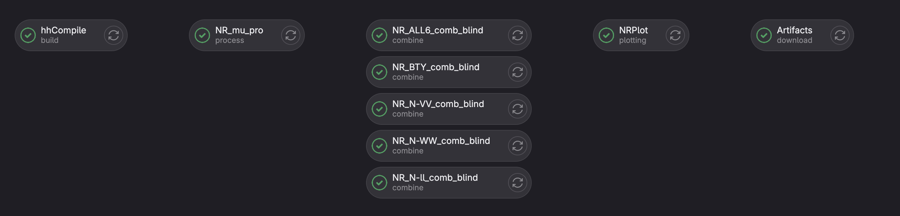

# Di-Higgs combination framework
This is the framework for di-Higgs combination.
The latest workspaces to use are documented in [HHcomb Twiki](https://twiki.cern.ch/twiki/bin/view/AtlasProtected/DiHiggsCombination).

Current relevant folders are:

    |-- scripts
    |-- python_modules
    |-- README.md
    |-- setup.sh
    |-- compile.sh
    |-- doc
    |-- submodules
        |-- RooFitExtensions
        |-- RooStatTools
        |-- workspaceCombiner

Caveats:
- The submodules `DiagnosticTools` will be replaced by something else soon.
- The submodules `hh_plot` is phasing out and replaced by `plotting/`.
- Currently stuck at some commit on workspaceCombiner:development branch. Need to update `RooStatTools` to catch the changes.
## How to run (on lxplus)
### Check out the packages
```
git clone --recursive ssh://git@gitlab.cern.ch:7999/atlas-physics/HDBS/DiHiggs/combination/hh_combination_fw.git
```
Just check if you miss any submodules (sometimes it happens silently!).
### Patch `workspaceCombiner`
The dataset name is not customisable in `workspaceCombiner` and the [TList indexing bug](https://indico.cern.ch/event/1025636/contributions/4311962/attachments/2222485/3763797/HHcomb20210408.pdf) needs a fix.
Apply the patch:
```
cd submodules/workspaceCombiner
git apply --whitespace=nowarn ../../workspaceCombiner.patch
```
### For the first time (need a compilation)
```
source compile.sh
source setup.sh
HHComb process_channels --new_method -i <input> -c <channel> -r nonres -o <output> --config configs/regularization_nonres_v3.yaml
...
HHComb combine_ws --new_method -i <output> -c bbbb,bbtautau,bbyy,WWWW,bbll,bbVV
...

```
You need to make sure the workspace can be found in `<input>/<channel>/nonres`.

### For the future time
```
source setup.sh
HHComb process_channels --new_method -i <input> -c <channel> -r nonres -o <output> --config configs/regularization_nonres_v3.yaml
...
HHComb combine_ws --new_method -i <output> -c bbbb,bbtautau,bbyy,WWWW,bbll,bbVV
...
```

### Plotting
Plot for non-resonant and spin0:
```
python plotting/xsection/combination_plotting.py nonres  --logx --dat_list $input_dir/limits/root-files/spin0/bb*/*[0-9].json --com_list $input_dir/limits/root-files/spin0/combined/A-*-nocorr/*[0-9].json --unblind

python plotting/xsection/combination_plotting.py nonres  --logx --dat_list $input_dir/limits/root-files/spin0/bb*/*[0-9].json --com_list $input_dir/limits/root-files/spin0/combined/A-*-nocorr/*[0-9].json --unblind

```
## Check and download results from gitlab CI
The whole workflow is running on gitlab CI.
Go to `CI/CD > Pipelines` and click on any of the recent `passed` task, then you will see the following display:


To check the final result, click on the `Plotting` jobs and click on the `Browser` botton on the right.

You can download the whole output from the `Download` botton.

## Some useful tips
### Run limit on a workspace
```
quickstats cls_limit -i <input_root_file> --poi xsec_br --print_level 1 --strategy 1
```

### Inspect workspaces
```
quickstats inspect_ws pois -i <input_root_file>
```


</p>
</details>
<details><summary>Old README</summary>
<p>
## Description

A python and C++ based software framework developed for the di-Higgs combination effort.

**Features:**
- Regularisation of [`RooFit::RooWorkspaces`][RooWorkspace] (workspaces), i.e. standardising the
    workspace, modelconfig, datanames.
- Rescaling of workspaces
    - specifying custom scaling factors for each production mode, channel and mass point
- Combination of workspaces
    - combine multiple workspaces at once
    - specifying custom correlations schemes
- Calculating limits
    - expected and/or observed
    - nominal and/or profiled NPs
- Parallel processing with the `multiprocessing` module.
- Scans in models with varying branching fractions (e.g. hMSSM)

Studies on the combined results (model intrepretation, sanity checks, etc.) is maintained in a
separate repository at:
- https://gitlab.cern.ch/atlasHBSM/atlas-phys-higgs-dihiggs-combteam/hh_studies

**For any questions please contact:**
- david.englert@cern.ch

## Dependencies

- [`ROOT`][ROOT]
- [`workspaceCombiner`][workspaceCombiner]
    - `boost`
- `python`
- `gcc/g++`

The framework also have the following packages as `git` `submodules`:
- [`RooStatTools`][RooStatTools]
- [`ModelTools`][ModelTools]
- [`PhysicsLib`][PhysicsLib]
- [`UtilTools`][UtilTools]

These packages should be automatically checked out if you are cloning with the `--recursive` flag
(see below for setup instructions).

## Setup instructions

Please see detailed setup instructions in [./doc/setup.md](./doc/setup.md).

## Usage instructions

### Tests

Reference test scripts can be found in the `./tests/` directory.
Documentation of the tests: [./doc/tests.md][tests]

### Scripts

Live scripts use for the combination can be found in the [`./scripts`](./scripts) directory.
Please do not edit these scripts, but use these as a template for your own ones.

- [`./scripts/pipeline/processChannels.py`](./scripts/pipeline/processChannels.py): Handles the regularisation and rescaling of the
    workspaces. Please [see the associated documentation here.][processChannels_doc]
- [`./scripts/combination/auto/combine_ws.py`](./scripts/combination/auto/combine_ws.py): Combines the workspaces.
    Please [see the associated documentation here.][combine_ws_doc]
- [`./scripts/hMSSM_scan/setup_scan.py`](./scripts/hMSSM_scan/setup_scan.py),
    [`./scripts/hMSSM_scan/pool_processed_scan_pts.py`](./scripts/hMSSM_scan/pool_processed_scan_pts.py),
    model scan example scripts. Please [see the associated documentation here.][model_scan_doc]

### UNIX style commands

Such as `quickLimit`, `wscontent`, `runNPranking`.
More info within [RootStatTools command documentation](https://gitlab.cern.ch/atlasHBSM/atlas-phys-higgs-dihiggs-combteam/RooStatTools/blob/master/doc/cmd/commands.md)

### Naming conventions for input/output

The framework uses some conventions for the naming of the input workspaces, to identify the
production mode, channels, mass points, which you can find here:
[./doc/conventions.md][conventions].

## Combination details

Please [find the details of the combination here.][combination_details]

## Model scans

Please [see the associated documentation here.][model_scan_doc]

### hMSSM

Associated scripts:
- [`./scripts/hMSSM_scan/setup_scan.py`](./scripts/hMSSM_scan/setup_scan.py)
- [`./scripts/hMSSM_scan/pool_processed_scan_pts.py`](./scripts/hMSSM_scan/pool_processed_scan_pts.py)

### Singlet model

Done in jupyter notebooks (to be uploaded later on).

## Documentation

You can find more documentation on the package [`./doc`](./doc) folder.


[combination_details]: ./doc/combination_details.md
[tests]: ./doc/tests.md
[hh_combination_fw]: https://gitlab.cern.ch/atlasHBSM/atlas-phys-higgs-dihiggs-combteam/hh_combination_fw
[workspaceCombiner]: https://twiki.cern.ch/twiki/bin/viewauth/AtlasProtected/WorkspaceCombiner
[workspaceCombiner_install]: https://twiki.cern.ch/twiki/bin/viewauth/AtlasProtected/WorkspaceCombiner#Installation
[workspaceCombiner_combination]: https://twiki.cern.ch/twiki/bin/viewauth/AtlasProtected/WorkspaceCombiner#Workspace_combination
[ROOT]: https://root.cern.ch/ 
[RooWorkspace]: https://root.cern.ch/doc/master/classRooWorkspace.html
[RooStatTools]: https://gitlab.cern.ch/atlasHBSM/atlas-phys-higgs-dihiggs-combteam/RooStatTools
[ModelTools]: https://gitlab.cern.ch/atlasHBSM/atlas-phys-higgs-dihiggs-combteam/ModelTools
[UtilTools]: https://gitlab.cern.ch/atlasHBSM/atlas-phys-higgs-dihiggs-combteam/UtilTools
[PhysicsLib]: https://gitlab.cern.ch/atlasHBSM/atlas-phys-higgs-dihiggs-combteam/PhysicsLib
[how_to_update]: ./doc/for_analysis_contacts.md
[conventions]: ./doc/conventions.md
[processChannels_doc]: ./doc/processChannels.md
[combine_ws_doc]: ./doc/combine_ws.md
[model_scan_doc]: ./doc/model_scan.md

</p>
</details>
