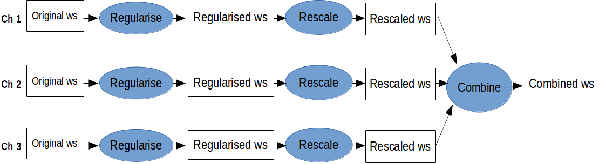

## Combination

Folder: `./scripts/combination/auto`

To perform the combination of different channels in an automated fashion please follow the below
steps:

1. Specify the necessary information needed to carry out the combinations. These include:
    - mass spacing
    - path to the folder containing original workspaces
    - path to the output folders, containing the regularised, rescaled and combined workspaces.
    - rescaling factors
    - combination variations (e.g. with or wout correlations)

    At the present these are stored in the `.py` scripts themselves. Future plan is to store these
    separately in a config file.
2. Regularise workspaces with `regularise.py`.
    In this step we change the `RooFit::RooWorkspace` name to `combWS` and the `RooStat::ModelConfig` name to `ModelConfig`
3. Rescale with `rescale.py`
    Rescale the POIs with the initial MC cross sections and other arbitrary normalisations in order
    to give the POIs a definite meaning (e.g. &sigma;(pp->S->hh) [fb]).
4. Perform combination with `perform_combination.py`

Do all at once: `doAll.sh`

## Limit setting

Folder: `./scripts/limits/`

1. Calculate CLs limits
    Use: `./scripts/limits/calculate_limits.py`

2. Extract limits from the `.root` files, and store these in ASCII datafiles.
    Use: `./scripts/limits/create-datafiles.py`

3. Make limit plots 
    Use: `./scripts/limits/makePlots.py` 
    The plotting section of the code has some packages requirements on top of standard `ROOT` + `python` core packages.
    These are default libraries in the python  data science community):
    - [`pandas`](pandas)
    - [`numpy`](numpy)
    - [`matplotlib`](matplotlib)
    It is recommend to install these with [`anaconda`](anaconda) or `pip`.
    If you don't want to install these feel free to use another package to plot your graphs with (e.g. ROOT).
